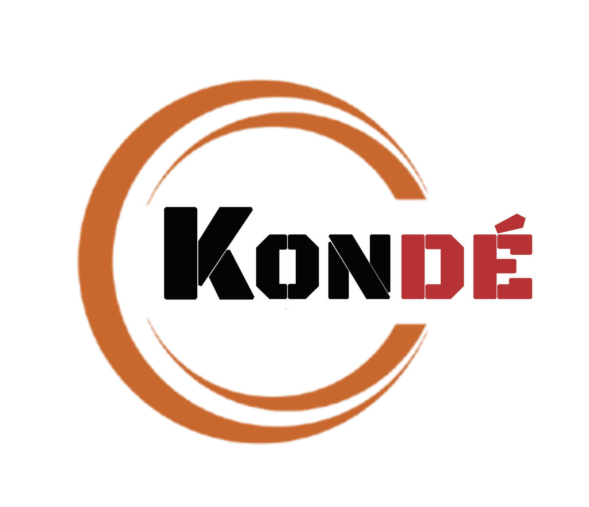

# Portfolio Numerique — TAKARA Kondeabalo Calixte

<p align="center">
  
</p>

<p align="center">
  <strong>Developpeur Web & Mobile | Graphiste Designer</strong><br>
  Etudiant en Licence Professionnelle — Architecture Logicielle (L2) à l'Universite de Kara.
</p>

<p align="center">
  <a href="https://github.com">
    
  </a>
</p>

---

## A propos de moi

Originaire du Togo, j'allie la rigueur du code a la sensibilite du design. Etudiant en developpement web, mobile et graphiste, je dedie mon parcours a l'excellence numerique.

Pour moi, le developpement est un art de la structure : je code pour concevoir des solutions fluides, robustes et evolutives. Ma maitrise du design me permet de penser l’experience utilisateur globale pour batir des applications aussi esthetiques qu'intuitives.

## Stack Technologique & Competences

### Developpement Software
* **Frontend :** React.js, TypeScript, Tailwind CSS, Framer Motion, HTML5 / CSS3
* **Backend & Base de donnees :** Node.js, Express, MongoDB
* **Mobile :** Conception d'interfaces applicatives natives et fluides

### Design Graphique
* **Identite Visuelle :** Creation de chartes graphiques et logos corporatifs
* **Supports Print :** Conception d'affiches evenementielles, flyers, depliants et brochures

## Structure du Projet

Ce portfolio est developpe sous forme d'une application Single Page (SPA) moderne et reactive, articulee autour des composants suivants :
* **HeroSection :** Accueil immersif avec effet cascade de texte et animations fluides.
* **ServicesSection :** Presentation des facettes d'expertises (Web, Mobile, Design) avec un effet de micro-interactions au survol.
* **AboutSection (Artiste) :** Manifeste de developpement, vision professionnelle et parcours academique chronologique detaille.
* **ProjectsSection :** Grille de realisations recentes avec redirection vers les depots de code et les maquettes associees.
* **ContactSection :** Formulaire minimaliste avec effet de bouton ascendant et Scroll Spy dynamique synchronise avec la barre de navigation.

## Installation et Lancement Local

Ce projet a ete initialise avec l'environnement Vite / React / TypeScript. Pour l'executer en local :

1. **Cloner le repository :**
   ```bash
   git clone https://github.com/Mon-portfolio-github.git
   ```

2. **Acceder au dossier du projet :**
   ```bash
   cd Mon-portfolio-github
   ```

3. **Installer les dependances :**
   ```bash
   npm install
   ```

4. **Lancer le serveur de developpement :**
   ```bash
   npm run dev
   ```

## Projets Connexes
En parallele de ce site vitrine, je developpe des architectures logicielles back-end :
* **API_librairies :** Une API Express/MongoDB robuste concue pour la gestion de bibliotheques.

## Me Contacter
* **Email :** calixtetakara5@gmail.com
* **LinkedIn :** https://linkedin.com
* **Telephone / WhatsApp :** +228 93 60 47 12

---
<p align="center">Concu avec rigueur et passion par Calixte Takara. © 2026</p>
